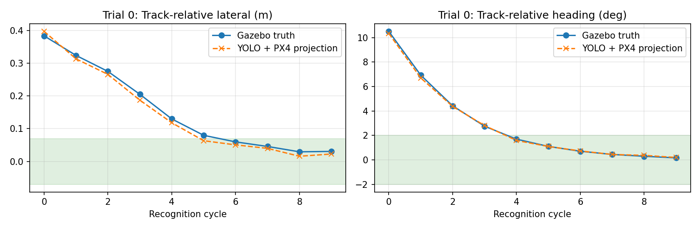
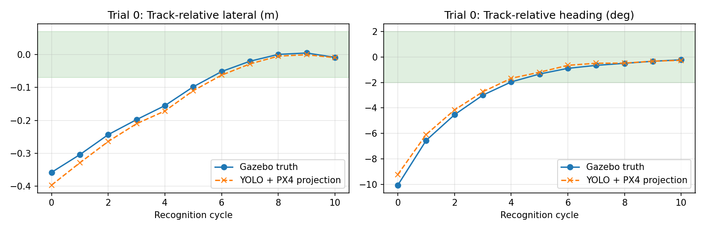

# 米制视觉闭环边界验证

验证日期：2026-09-16。

本验证使用直轨 Gazebo 世界、PX4 SITL、Spring YOLO 轨道区域分割模型以及
`scripts/run_metric_closed_loop.py`。图像直接来自 Gazebo Transport；图像与
评估真值按同一仿真时间戳对齐。Gazebo 真值只用于评估和起飞前轨面高程标定，
不输入轨道识别或控制器。

## 结果

| 指标 | 正向工况 | 反向工况 |
|---|---:|---:|
| 实际横偏 | +0.384 → +0.031 m | -0.358 → -0.008 m |
| 实际航向 | +10.51 → +0.16° | -10.06 → -0.22° |
| 有效识别轮次 | 10/10 | 11/11 |
| 横偏估计 MAE | 0.012 m | 0.014 m |
| 航向估计 MAE | 0.07° | 0.26° |
| 高度误差平均/最大 | 0.010/0.030 m | 0.030/0.050 m |
| 0.10 m/s 前进脉冲 | 3 | 3 |
| 降落确认 | 是 | 是 |
| 异常记录 | 无 | 无 |

## 结论边界

两组试飞验证了约 ±0.4 m、±10° 两种误差符号下的慢速闭环，以及“连续三轮
对准后才允许前进”的门控逻辑。结果只适用于当前直轨、单纹理和低速仿真环境，
尚未覆盖弯道、风扰、强滚转/俯仰、真实相机、实体树莓派时延、人员停车和长距离
持续飞行。

复现入口与核心代码：

- [`scripts/run_metric_closed_loop.py`](../../scripts/run_metric_closed_loop.py)
- [`src/uav_demo/ground_projection.py`](../../src/uav_demo/ground_projection.py)
- [`src/uav_demo/metric_rail_geometry.py`](../../src/uav_demo/metric_rail_geometry.py)
- [`src/uav_demo/metric_control.py`](../../src/uav_demo/metric_control.py)
- [`docs/simulation/metric-closed-loop.md`](../simulation/metric-closed-loop.md)
